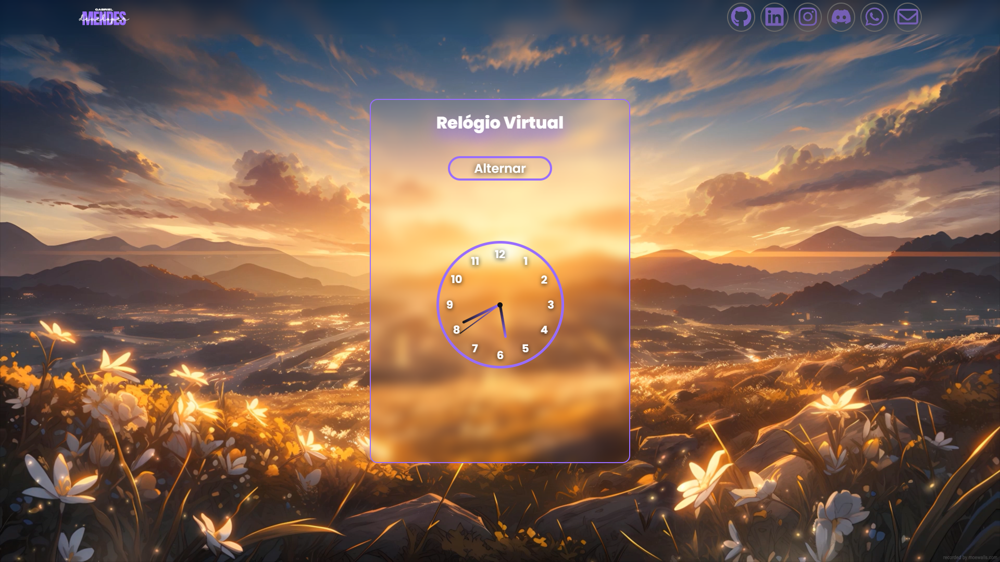
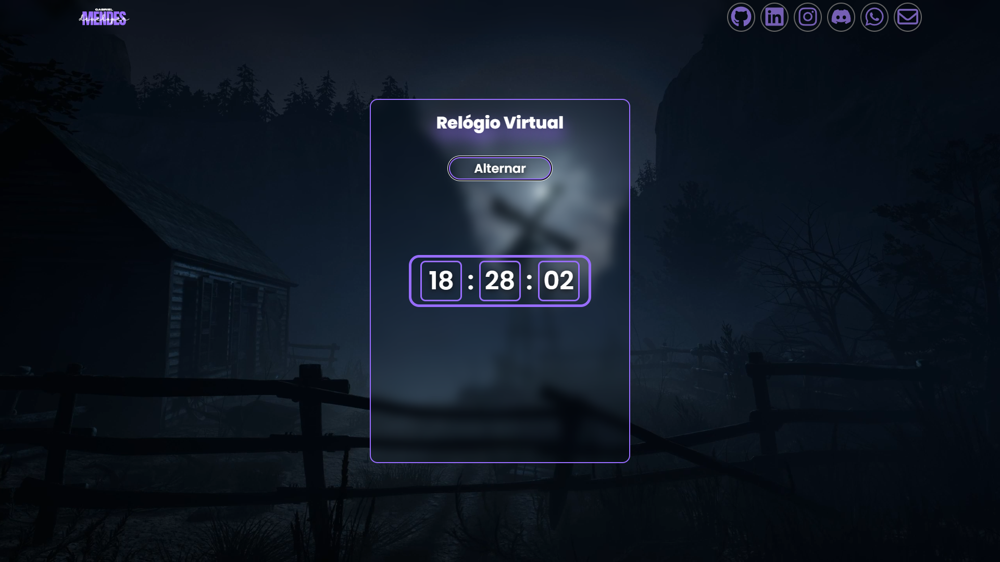
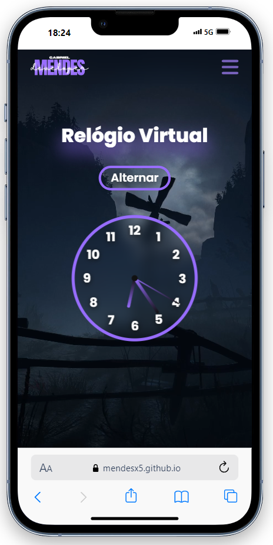
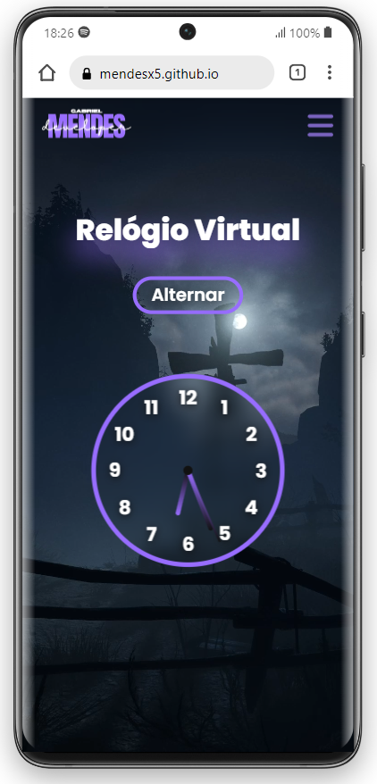
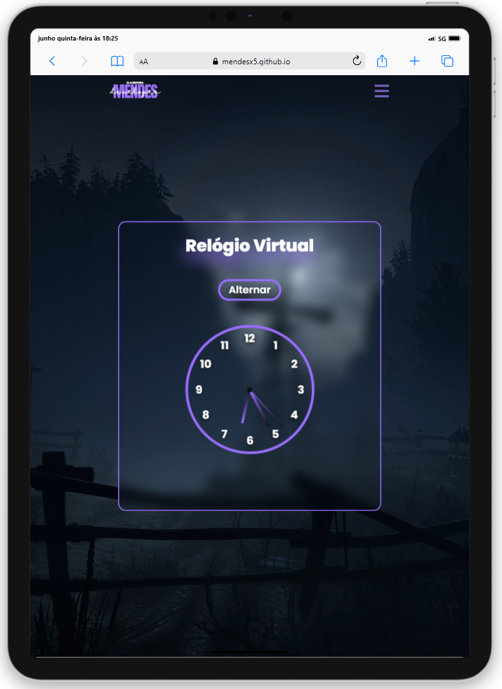

# ⌚ Relógio Virtual Responsivo

  <h2>🖥 Desktop:</h2>
  
  

  <h2>📱 Mobile:</h2>
  
  
  

## 🔎 Acesse aqui: [DEPLOY](https://mendesx5.github.io/VirtualClock/)
## 📝 About:

  Este Relógio Virtual foi desenvolvido por mim(Gabriel Mendes), com o inuito de mostrar minhas habilidades.  
  No site, o relógio está em modelo de ponteiro opu digital, caso deseje alternar entre um ou outro, há um botão "Alternar", 
  para que seja trocado de um modelo para outro. O site foi projetado para ser responsivo, e atender as demandas de todo tipo 
  de usuário, podendo ser utilizado em Desktop ou Mobile.
  O plano de fundo do site é baseado no horário em que se encontra atualmente, sendo que se estiver de dia, o fundo estará claro, 
  caso esteja a noite, o fundo estara escuro.

